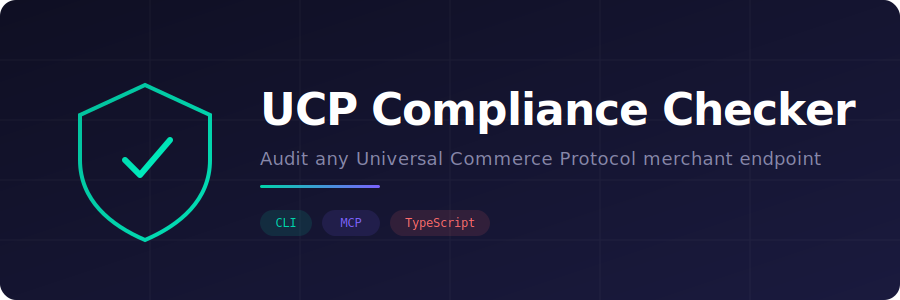

<p align="center">
  
</p>

<p align="center">
  <strong>Audit any UCP merchant endpoint for spec compliance — from your terminal or from Claude.</strong>
</p>

<p align="center">
  <a href="#cli-usage">CLI</a> · <a href="#mcp-usage">MCP Tool</a> · <a href="#checks">Checks</a> · <a href="#license">License</a>
</p>

---

## What is this?

Point it at any URL claiming to be a [Universal Commerce Protocol](https://ucp.dev) merchant and it runs automated checks across discovery, catalog, checkout, and general compliance — reporting what's correct, what's non-standard, and what's broken.

Validates against the **official UCP spec (2026-01-23)** while also recognizing legacy/pre-spec implementations.

Works as a **CLI tool** you run from the terminal, or as an **MCP server** that Claude can call directly.

```
UCP Compliance Report for https://puddingheroes.com
━━━━━━━━━━━━━━━━━━━━━━━━━━━━━━━━━━━━━━━━━━━━━━━━━━
✓ General: HTTPS used
✗ Discovery: /.well-known/ucp returns valid JSON — Content-Type was text/html (not JSON)
⚠ Discovery: discovery found at non-standard path — /api/ucp/discovery is not in the UCP spec
⚠ Discovery: ucp.version present and YYYY-MM-DD format — "1.0" — spec requires YYYY-MM-DD
⚠ Discovery: ucp.services uses spec format (reverse-domain keyed) — Using legacy flat service paths
✓ Discovery: capabilities declared
✓ Discovery: capabilities follow dev.ucp.* namespace
✓ Discovery: service endpoints declared
⚠ Discovery: payment handlers declared (ucp.payment_handlers) — Spec requires payment_handlers in ucp object
✓ Catalog: products endpoint returns 200
✓ Catalog: products have required fields (id, name, price, currency)
✓ Catalog: single product lookup by ID (GET)
✓ Checkout: checkout endpoint resolvable
✓ Checkout: POST checkout-sessions returns 200/201 — 201
✓ Checkout: response contains session id
✓ Checkout: response contains line_items
✓ Checkout: response contains totals
━━━━━━━━━━━━━━━━━━━━━━━━━━━━━━━━━━━━━━━━━━━━━━━━━━
Result: 14 passed, 4 warnings, 1 failed
```

## Quick Start

```bash
git clone https://github.com/davillafer/UCP-Compliance-Checker.git
cd UCP-Compliance-Checker
npm install

npx tsx src/cli.ts https://puddingheroes.com
```

## CLI Usage

```bash
# Human-readable output
npx tsx src/cli.ts https://puddingheroes.com

# JSON output (for scripting / CI)
npx tsx src/cli.ts https://puddingheroes.com --json
```

Exit codes: `0` = all checks passed, `1` = at least one failure, `2` = fatal error.

## MCP Usage

Add to your `.mcp.json` (Claude Code, Cursor, etc.):

```json
{
  "mcpServers": {
    "ucp-compliance-checker": {
      "command": "npx",
      "args": ["tsx", "src/index.ts"]
    }
  }
}
```

Then ask Claude:

> _"Check UCP compliance for https://puddingheroes.com"_

Claude calls the `check_compliance` tool and returns a structured report.

## Checks

### Discovery
- `/.well-known/ucp` returns 200 with valid JSON (canonical path per spec)
- Falls back to `/api/ucp/discovery` with a warning if `/.well-known/ucp` fails
- `Content-Type` is `application/json`
- `ucp.version` present in `YYYY-MM-DD` format (e.g. `2026-01-23`)
- `ucp.services` uses spec format (reverse-domain keyed with transport bindings)
- Capabilities declared as reverse-domain keyed object or array
- Capabilities follow `dev.ucp.*` namespace convention
- Service endpoints declared and resolvable
- `ucp.payment_handlers` declared (warning if missing)

### Catalog
- **Spec path**: `POST /catalog/search` at the shopping service endpoint
- **Spec path**: `POST /catalog/lookup` for single product by ID
- **Legacy fallback**: `GET /products` and `GET /products/:id`
- Spec required fields: `id`, `title`, `description`, `price_range`, `variants`
- Legacy required fields: `id`, `name`/`title`, `price`, `currency`

### Checkout
- Checkout endpoint resolvable from discovery
- `POST /checkout-sessions` with spec headers (`UCP-Agent`, `Idempotency-Key`, `Request-Id`)
- `UCP-Agent` header uses spec format: `profile="<discovery-url>"`
- Response contains `id`, `line_items`, `totals`
- Spec-only: `status` enum, `currency`, `ucp` metadata, `links` (TOS/privacy)

### General
- HTTPS used (warning if HTTP)

## Spec vs Legacy

The checker validates against the **official UCP spec (2026-01-23)** from the [Universal-Commerce-Protocol](https://github.com/Universal-Commerce-Protocol) GitHub org. It also recognizes legacy implementations and reports deviations clearly:

| Aspect | Spec (2026-01-23) | Legacy (e.g. Pudding Heroes) |
|--------|-------------------|------------------------------|
| Discovery path | `/.well-known/ucp` | `/api/ucp/discovery` |
| Version format | `YYYY-MM-DD` | Free-form (e.g. `"1.0"`) |
| Services | Reverse-domain keyed objects | Flat string paths |
| Capabilities | Reverse-domain keyed objects | Flat string array |
| Payment handlers | `ucp.payment_handlers` (keyed) | `payment.handlers` (array) |
| Catalog | `POST /catalog/search` | `GET /products` |
| Product lookup | `POST /catalog/lookup` | `GET /products/:id` |
| Product fields | `id`, `title`, `price_range`, `variants` | `id`, `name`, `price`, `currency` |
| Checkout body | `{ line_items: [{ item: { id }, quantity }] }` | `{ line_items: [{ product_id, quantity }] }` |
| UCP-Agent header | `profile="<uri>"` | Free-form string |

## Project Structure

```
src/
├── index.ts              # MCP server (check_compliance tool)
├── cli.ts                # Commander CLI
├── checker.ts            # Core engine — fetchJson, resolveUrl, runChecks
├── checks/
│   ├── discovery.ts      # Discovery validation (spec + legacy)
│   ├── catalog.ts        # Catalog checks (POST /catalog/search + GET fallback)
│   ├── checkout.ts       # Checkout session probing with spec headers
│   └── general.ts        # HTTPS check
└── lib/
    └── reporter.ts       # Types + formatted output
```

## Known Live UCP Endpoints

| Merchant | URL | Format |
|----------|-----|--------|
| Pudding Heroes | `https://puddingheroes.com` | Legacy (v1.0) |
| UCP Demo | `https://ucp-demo-api.hemanthhm.workers.dev` | Spec (v2026-01-23) |

## Tech Stack

- **TypeScript** with native `fetch`
- **[@modelcontextprotocol/sdk](https://npmjs.com/package/@modelcontextprotocol/sdk)** for the MCP server
- **[Commander](https://npmjs.com/package/commander)** for CLI parsing
- **[Zod](https://npmjs.com/package/zod)** for input validation

## License

[MIT](LICENSE)
